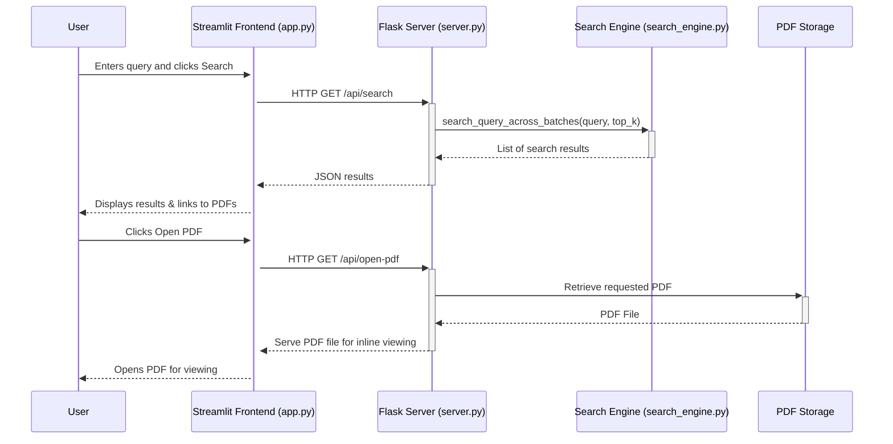
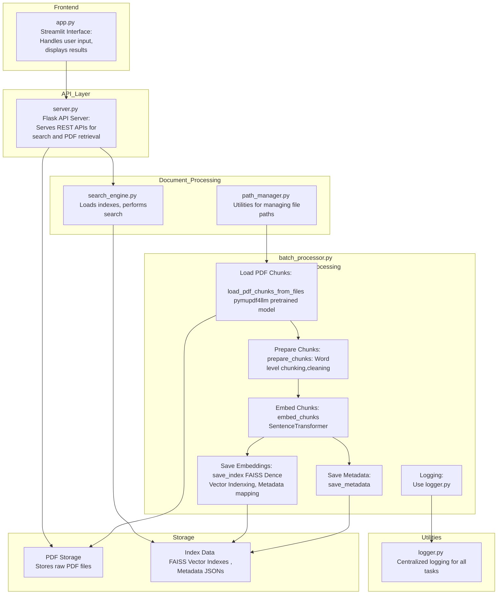

# SRM_Demo Dashboard

## Overview
The **SRM_Demo Dashboard** is a Streamlit-based frontend application for interacting with the backend search functionality. It provides a user-friendly interface to input queries, retrieve results, and access document content directly.

## Features
- **Search Functionality**: Enter a query to search indexed documents.
- **Customizable Result Count**: Adjust the number of results displayed using a slider.
- **Document Previews**: Displays snippets from matched documents alongside page numbers.
- **PDF Access**: Provides direct links to view PDF files, jumping to the relevant page.

---

## Technologies Used
- **Streamlit**: Framework for building web applications.
- **Requests**: For interacting with the backend RESTful APIs.
- **Python**: Used for all application logic.

---

## How It Works
1. **Query Input**: Enter a search query through the text box.
2. **Result Limit**: Use the slider to choose the maximum number of results displayed.
3. **Search Execution**: Press the **Search** button to send the query to the backend API.
4. **Render Results**: Results include:
   - File name and corresponding page.
   - Snippet of text from the document.
   - Link to open the PDF (jumps directly to the relevant page).

---
## Bird Eye View


## Installation and Setup

1. Clone the repository:
   ```bash
   git clone https://github.com/MilanSavani010/SRM_Demo
   cd SRM_Demo
   ```

2. Set up a virtual environment:
   ```bash
   python3 -m venv venv
   source venv/bin/activate
   ```

3. Install dependencies:
   ```bash
   pip install -r requirements.txt
   ```

4. Start the **backend server**:
   - Navigate to the directory that contains `server.py` and run:
     ```bash
     python server.py
     ```

5. Launch the **Streamlit app**:
   - Run the Streamlit dashboard:
     ```bash
     streamlit run app.py
     ```

---

## User Guide

1. Open the dashboard in your browser (usually default at: `http://localhost:8501`).
2. Use the text input box to write your query.
3. Adjust the slider to select the number of results to display (default: 5).
4. Click the "Search" button to get results.
5. View the list of search results with:
   - File name
   - Page number
   - Text snippet
   - Link to view the PDF (direct navigation to the relevant page).

---

## Example Flow

1. Query:  
   Enter a query, such as `"safety procedures"`.

2. Result Customization:  
   Slide the adjustable bar to select how many top results to display (e.g., 3).

3. Search Results:  
   Results will show:
   ```
   document.pdf - Page 2
   "Text snippet matching the query"
   [Open PDF File]
   ```

4. Open PDF:  
   Click the `Open PDF File` link to view the document directly, opening the relevant page.

---

## Future Enhancements
- Add authentication for dashboard access.
- Implement result sorting and filtering.
- Include a file upload feature for users to index their documents dynamically.
- Optimize query performance for larger datasets.

---

## Contributing
Contributions are always welcome. Please feel free to open issues or submit a pull request.

---
