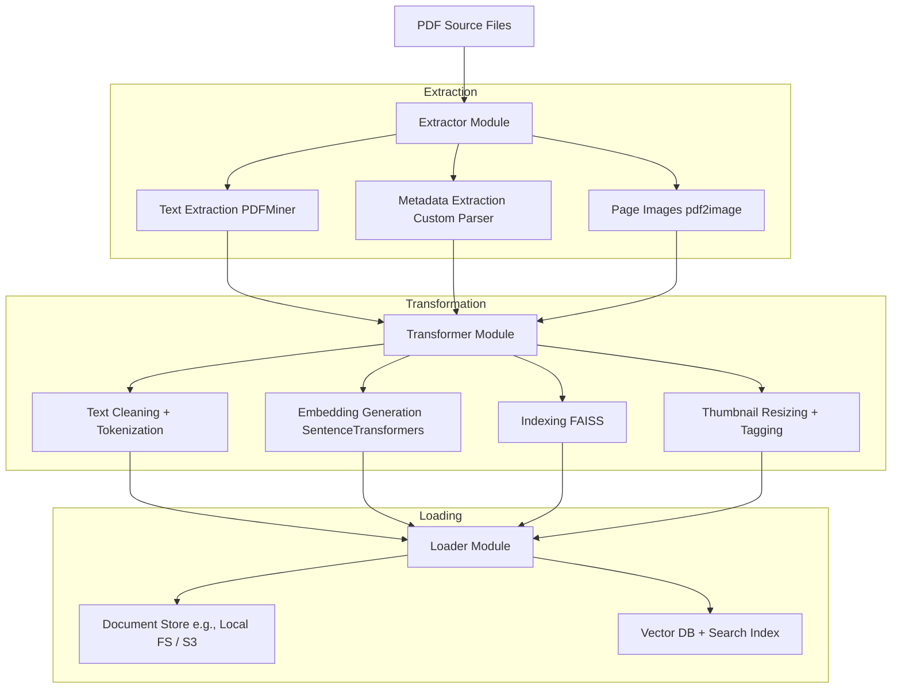

```mermaid
flowchart TD
    A[PDF Source Files] --> B[Extractor Module]
    B --> B1[Text Extraction PDFMiner]
    B --> B2[Metadata Extraction Custom Parser]
    B --> B3[Page Images pdf2image]
    
    B1 --> C[Transformer Module]
    B2 --> C
    B3 --> C

    C --> C1[Text Cleaning + Tokenization]
    C --> C2[Embedding Generation  SentenceTransformers]
    C --> C3[Indexing FAISS ]
    C --> C4[Thumbnail Resizing + Tagging]

    C1 --> D[Loader Module]
    C2 --> D
    C3 --> D
    C4 --> D

    D --> E[Document Store e.g., Local FS / S3]
    D --> F[Vector DB + Search Index]

    subgraph Extraction
        B
        B1
        B2
        B3
    end

    subgraph Transformation
        C
        C1
        C2
        C3
        C4
    end

    subgraph Loading
        D
        E
        F
    end
```
